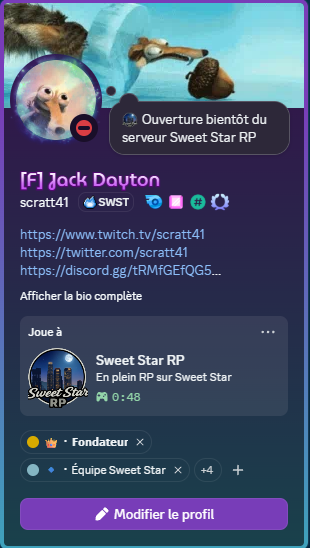

# 🌟 Simple Discord Rich Presence for FiveM

[FR] Un script léger et facile à configurer pour afficher le logo de votre serveur sur le profil Discord de vos joueurs.  
[EN] A lightweight and easy-to-configure script to display your server logo on your players' Discord profiles.

---

## 🇫🇷 Français (French)

### 🚀 Installation
1. Téléchargez le dossier et placez-le dans le répertoire `resources` de votre serveur.
2. Ajoutez la ligne `ensure simple_fivem_rpc` dans votre fichier `server.cfg`.
3. Modifiez le fichier `config.lua` avec vos propres informations.

### 🛠️ Configuration sur le Portail Discord
1. Rendez-vous sur le [Discord Developer Portal](https://discord.com/developers/applications).
2. Créez une **Nouvelle Application** (New Application) et copiez l'**ID de l'application** (Application ID).
3. Allez dans l'onglet **Rich Presence** puis dans **Ressources artistiques**.
4. uploaser votre logo (Image de couverture).
5. **Important :** Notez le nom que vous donnez à l'image (**Asset Key**). C'est ce nom que vous devrez reporter dans la ligne `Config.LargeImage` du fichier `config.lua`.

---

## 🇺🇸 English

### 🚀 Installation
1. Download the folder and place it into your server's `resources` directory.
2. Add `ensure swst_presence` to your `server.cfg` file.
3. Edit the `config.lua` file with your own information.

### 🛠️ Discord Developer Portal Setup
1. Go to the [Discord Developer Portal](https://discord.com/developers/applications).
2. Create a **New Application** and copy the **Application ID**.
3. Navigate to the **Rich Presence** tab, then click on **Art Assets**.
4. Upload your logo (Upload Assets).
5. **Important:** Take note of the name you give to the image (**Asset Key**). You must enter this exact name in the `Config.LargeImage` line within the `config.lua` file.

---

## 📝 Crédits / Credits
- **Author:** [scratt41]
- **License:** MIT
